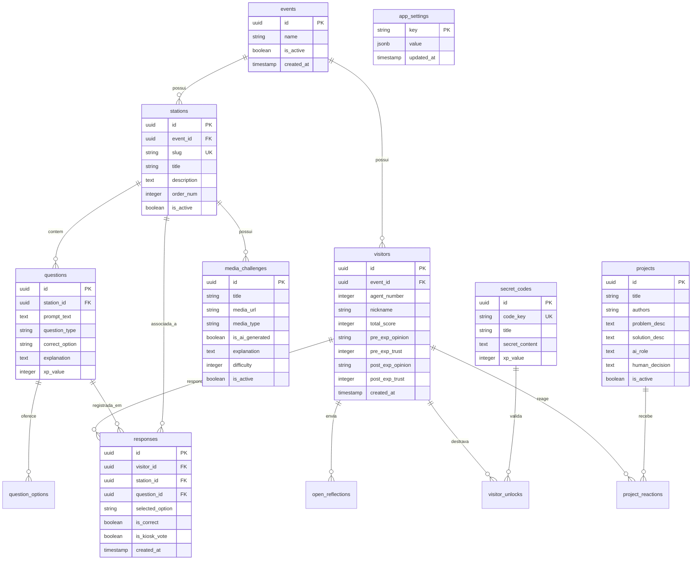

# TURING LAB — ESPECIFICAÇÃO TÉCNICA E ARQUITETURAL

> **Documento Oficial de Arquitetura, Design e Engenharia**  
> **Aplicação:** TURING LAB  
> **Destino:** Feira Escolar de Ciências e Tecnologia  
> **Plataformas de Hospedagem & Banco:** Vercel + Supabase  
> **Pergunta Central:** *"Máquinas podem pensar?"* ➔ *"O que devemos deixar as máquinas decidirem?"*

---

## 1. RESUMO DO ENTENDIMENTO & OBJETIVOS

* **Propósito:** Uma aplicação web progressiva e interativa que opera como um **Passaporte Digital de Investigação**, guiando o visitante através de 9 estações físicas e interativas na sala da exposição sobre Alan Turing, Inteligência Artificial, ética e futuro.
* **Público-Alvo:** Comunidade escolar ampla (crianças, adolescentes, familiares e professores), com interação mobile rápida, visual e sem cadastro pessoal.
* **Ambientes do Sistema:**
  1. **Passaporte do Visitante:** Interface mobile-first (PWA) no celular pessoal do visitante.
  2. **Totem/Quiosque de Bancada (`/quiosque/[slug]`):** Terminais rápidos em tablets/monitores fixos para voto pontual e auto-reset.
  3. **Turing Lab Live (`/live`):** Telão no projetor/TV da sala exibindo estatísticas em tempo real e visualização coletiva da *Rede Turing*.
  4. **Painel Administrativo (`/admin`):** Central de controle protegida por PIN Mestre para configuração da feira, moderação e exportação.

---

## 2. PREMISSAS E NÃO-OBJETIVOS (NON-GOALS)

### Premissas Adotadas
1. **Escala Concorrente:** Estimativa de até 30 visitantes simultâneos. Perfeitamente compatível com os limites gratuitos do Supabase (até 200 conexões realtime simultâneas) e Vercel Hobby/Pro.
2. **Privacidade Total (LGPD / Proteção de Menores):** Nenhum dado pessoal obrigatório (sem nome civil completo, e-mail ou telefone). Cada visitante recebe um identificador anônimo (`AGENTE #0472`), podendo escolher apenas um codinome/apelido público se desejar participar do ranking.
3. **Resiliência Offline:** O Wi-Fi escolar pode oscilar. Respostas são salvas localmente no `LocalStorage` antes do envio, com fila de reenvio automático assim que a rede se restabelecer.

### Não-Objetivos (Explicit Non-Goals)
* Não é um formulário de quiz avaliativo escolar com notas ou punição por erro.
* Não é um app nativo de loja (sem publicação na App Store ou Google Play).
* Não haverá ranking público de crianças com dados reais ou competição humilhante. O foco é aprendizado e descoberta reflexiva.

---

## 3. REGISTRO DE DECISÕES DE ARQUITETURA (DECISION LOG)

| ID | Tópico | Decisão Tomada | Alternativas Consideradas | Justificativa |
|---|---|---|---|---|
| **DEC-001** | Stack de Aplicação | **Next.js 15 (App Router) + Supabase + Vercel** | SPA Vite puro, Monorepo separado | Unifica frontend, rotas de API protegidas e renderização híbrida com deploy direto e zero atrito de infraestrutura. |
| **DEC-002** | Autenticação Admin | **PIN / Código Mestre em Middleware** | Supabase Auth (e-mail/senha) | Facilidade e rapidez para os professores operarem em tablets da feira sem gestão burocrática de contas. |
| **DEC-003** | Resiliência de Rede | **LocalStorage Queue + Fallback de Polling (10s)** | Service Worker BackgroundSync pesado | Simples, determinístico e não depende de recursos experimentais de navegadores mobile antigos. |
| **DEC-004** | Gamificação & Competição | **Codinome Opcional + Sistema de XP + Ranking no Telão** | Experiência estritamente anônima | Estimula o engajamento de adolescentes e crianças mantendo a conformidade com a privacidade escolar. |
| **DEC-005** | Terminais Fixos de Bancada | **Modo Quiosque Dedicado (`/quiosque/[slug]`)** | Telas de celular em tablets | Permite voto imediato sem cadastro para quem não quer celular, com auto-reset de 6 segundos. |
| **DEC-006** | Ação Rápida no Quiosque | **Botão explícito `[ ⏩ Pular ]`** | Apenas aguardar o timer de 6s | Evita filas travadas em horários de pico e permite ao visitante ver a explicação sem ser obrigado a votar. |

---

## 4. MAPA GERAL DE NAVEGAÇÃO & ROTAS

```
                                  [ ENTRADA GERAL ]
                                         │
                 ┌───────────────────────┴───────────────────────┐
                 │                                               │
      (Visitante no Celular)                           (Terminal Fixo / Tablet)
                 │                                               │
        ┌────────▼────────┐                             ┌────────▼────────┐
        │        /        │ (Boas-vindas + ID)          │ /quiosque/[slug]│
        └────────┬────────┘                             └────────┬────────┘
                 ▼                                               │
        ┌─────────────────┐                             [ Voto Único + Reset ]
        │   /passaporte   │ (Hub de Estações)
        └────────┬────────┘
                 │
   ┌─────────────┼───────────────┬────────────────┐
   ▼             ▼               ▼                ▼
/estacao/     /projetos   /arquivo-secreto   /conclusao
 [slug]        (9º Ano)      (Enigmas)       (Pergunta Final)
                                                  │
                                                  ▼
                                             [ Ranking ]

────────────────────────────────────────────────────────────────────────────────
        [ OUTROS AMBIENTES ]
        • /live   ➔ Telão em tempo real para TV / Projetor da Feira
        • /admin  ➔ Painel de controle e moderação dos professores
```

---

## 5. JORNADA COMPLETA DO VISITANTE

```
1. ESCANEAR QR CODE INICIAL (ou da primeira bancada)
   │
   ▼
2. RECONHECIMENTO DE IDENTIDADE
   ➔ Criação silenciosa: "AGENTE #0472"
   ➔ Opção imediata de editar codinome: [ ✏️ Detetive Turing ]
   │
   ▼
3. PERGUNTA PRELIMINAR (ANTES DA EXPERIÊNCIA)
   ➔ "Máquinas podem pensar?" [ SIM ] [ NÃO ] [ NÃO SEI ]
   ➔ "Nível de confiança em IA": Escala 0 a 10
   │
   ▼
4. PASSAPORTE TURING (NAVEGAÇÃO LIVRE PELA SALA)
   ➔ Estação 01: Humano ou Máquina? (Teste de Turing A/B)
   ➔ Estação 02: Máquina ou Inteligência? (Carrinhos de Automação vs Visão)
   ➔ Estação 03: Como uma IA aprende? (Dados e padrões)
   ➔ Estação 04: Engane a IA (Falhas e condições fora do treino)
   ➔ Estação 05: Detetive Real x IA (Identificar mídias sintéticas)
   ➔ Estação 06: Você confiaria na IA? (Dilemas éticos e decisões)
   ➔ Estação 07: Audite uma IA (Erros e checagem humana de cartazes)
   ➔ Estação 08: Projetos do 9º Ano (Reações e ideias reais)
   ➔ Arquivo Ultrassecreto: Pistas físicas e mini-puzzle Enigma
   │
   ▼
5. CONCLUSÃO DA INVESTIGAÇÃO
   ➔ Revelação do Teste de Turing (Você acertou quem era o humano?)
   ➔ Pergunta Posterior: "Depois de tudo o que viu, máquinas podem pensar?"
   ➔ Reflexão Ética Final: "O que devemos deixar as máquinas decidirem?"
   ➔ Exibição das Conquistas e Pontuação Total (XP)
```

---

## 6. MODELAGEM DO BANCO DE DADOS (SUPABASE / POSTGRESQL)

### Diagrama Entidade-Relacionamento (ERD)



---

## 7. ESTRATÉGIAS DE ENGENHARIA

### 7.1 Identificação Anônima e Persistência
* **Geração:** Na primeira montagem do app no cliente, `localStorage.getItem('turing_agent_session')` é verificado.
* Se ausente, o cliente gera um UUID v4 e requisita a criação em `visitors`.
* O número sequencial/código visual (ex: `AGENTE #0472`) é retornado e gravado no `localStorage`.
* **Zero Cookies Rastreadores:** O visitante não é rastreado entre sessões diferentes além de sua chave anônima.

### 7.2 Resiliência Offline e Sincronização
* As respostas do visitante são salvas primeiro em um array `offline_queue` no `localStorage`.
* Uma função de despacho assíncrona tenta persistir via Supabase.
* Se `navigator.onLine === false` ou a requisição falhar por timeout de Wi-Fi:
  - O app exibe um badge discreto: `[ 📡 Resposta salva localmente. Sincronizando... ]`.
  - Um listener de evento `window.addEventListener('online', flushQueue)` reenvia a fila assim que o sinal retorna.

### 7.3 Realtime do Telão (`/live`)
* O dashboard `/live` se inscreve no canal Supabase Realtime:
  ```typescript
  supabase
    .channel('live_dashboard')
    .on('postgres_changes', { event: 'INSERT', schema: 'public', table: 'responses' }, (payload) => {
      updateAggregatedStats(payload.new);
    })
    .subscribe();
  ```
* **Fallback de Polling Suave:** Paralelamente, a cada 10 segundos um `swr` ou `fetch` leve consulta o endpoint `/api/stats` para reconciliar eventuais mensagens perdidas em oscilações de WebSocket.

### 7.4 Segurança e Moderação
* **Políticas Row Level Security (RLS) no Supabase:**
  - `visitors` & `responses`: Inserção permitida para a role pública `anon`.
  - Leitura pública apenas de estatísticas agregadas (via views ou RPC) para que respostas individuais não fiquem expostas.
  - Modificação ou exclusão de dados restrita exclusivamente à Service Role (`admin`).
* **Proteção do Painel do Professor (`/admin`):**
  - Rota protegida por Next.js Middleware.
  - O professor digita o PIN Mestre (ex: 6 dígitos). A API valida contra hash com salt (`scrypt`/`bcrypt`) e emite um cookie assinado `httpOnly` de curta duração (12 horas).
* **Moderação de Textos Abertos:** Respostas abertas e reflexões da Estação Final entram no banco com `status = 'pending'`. Apenas mensagens com `status = 'approved'` pelo Admin aparecem na rotação do telão.

---

## 8. ESTRUTURA DO TURING LAB LIVE (`/live`)

Projetado para telas grandes (Full HD / 4K) em proporção 16:9, com contraste altíssimo e rotação contínua (ciclo padrão de 15 segundos por tela):

1. **TELA 1 — Visão Geral do Laboratório:** Total de Agentes convocados, total de interações/respostas, gráfico temporal de atividade.
2. **TELA 2 — O Teste de Turing & Máquinas:** Percentual de visitantes que identificaram o humano vs máquina; acertos da Estação dos Carrinhos (Automação vs IA).
3. **TELA 3 — Detetive Real x IA:** Mídia mais desafiadora da feira; percentual de participantes enganados pela IA.
4. **TELA 4 — Dilemas Éticos & Decisão:** Distribuição das perguntas críticas (*"Você permitiria que uma IA selecionasse empregos ou tomasse decisões médicas?"* — SIM, NÃO, DEPENDE).
5. **TELA 5 — Antes × Depois (A Evolução da Pergunta):** Mudança percentual na crença *"Máquinas podem pensar?"* antes e depois de percorrer as bancadas da sala.
6. **TELA 6 — Placar TOP 10 & A Rede Turing:** Ranking dos agentes com maior pontuação e visualização visual em Canvas com nós interconectados representando cada participante.

---

## 9. DESIGN SYSTEM (BLETCHLEY PARK ARCHIVE)

A identidade visual reflete um arquivo confidencial dos anos 1950 combinado com gráficos e nós de computação moderna.

### Tokens de Cores (Tailwind CSS v4)
* **`bg-archive-dark`:** `#090C10` (Carvão militar profundo)
* **`bg-archive-surface`:** `#121820` (Superfície de fichário confidencial)
* **`text-archive-paper`:** `#EBE7DD` (Pergaminho envelhecido legível)
* **`accent-amber-teletype`:** `#F59E0B` (Laranja/Âmbar de lâmpadas de teletipo e status)
* **`accent-tape-green`:** `#10B981` (Verde fósforo de terminais antigos)
* **`stamp-red-classified`:** `#E11D48` (Vermelho carimbo de arquivo ultrassecreto)
* **`border-archive`:** `#1F2937` (Bordas de grade e linhas milimetradas)

### Tipografia
* **Mono (Códigos, IDs, Fitas):** `JetBrains Mono`, `Fira Code` ou `Space Mono`.
* **Sans (Textos, Enunciados, Explicações):** `Inter` ou `Plus Jakarta Sans`.

### Componentes Assinatura
* `<TuringTapeHeader />`: Exibe a fita de máquina de Turing no topo da tela (`0 | 1 | A | B | →`). Transforma-se visualmente em código digital conforme o visitante avança.
* `<ClassifiedCard />`: Card com bordas milimetradas, cabeçalho de memorando confidencial e carimbo angular `[ TOP SECRET ]`.
* `<DecryptionText />`: Efeito visual suave de decodificação de caracteres ao carregar novos desafios.
* `<KioskActionControls />`: Botão primário grande de toque e botão explícito `[ ⏩ Pular ]`.

---

## 10. BACKLOG DE IMPLEMENTAÇÃO POR PRIORIDADE

### 🎯 FASE 1: MVP da Feira (Essencial & Obrigatório)
- [x] Especificação e arquitetura técnica concluídas.
- [ ] Configuração inicial do projeto Next.js 15 com Tailwind CSS e Supabase Client.
- [ ] Criação do schema SQL do Supabase (tabelas, triggers de pontuação e políticas RLS).
- [ ] Implementação da identidade anônima do Agente (`AGENTE #XXXX` + LocalStorage).
- [ ] Tela de Entrada (Boas-vindas + Pergunta Preliminar).
- [ ] Hub do Passaporte Turing com 9 estações.
- [ ] Estações Interativas principais (Teste de Turing, Carrinhos, Real x IA, Dilemas Éticos).
- [ ] Modo Quiosque de Bancada (`/quiosque/[slug]`) com Auto-reset e botão de Pular.
- [ ] Tela de Conclusão (Revelação do Teste de Turing + Pergunta Final).
- [ ] Telão Live (`/live`) com rotação de telas e Supabase Realtime.
- [ ] Painel Administrativo com autenticação por PIN Mestre e exportação CSV.

### 🌟 FASE 2: Gamificação & Engajamento
- [ ] Codinome customizável do Agente e Placar/Ranking TOP 10.
- [ ] Desafio Secreto do Arquivo Bletchley Park (Mini-puzzle Enigma).
- [ ] Sistema de Conquistas e Badges de Investigador.
- [ ] Visualização Artística Coletiva (A Rede Turing com Canvas interativo).
- [ ] Fila de Moderação para o Telão no painel do professor.

### 🚀 FASE 3: Refinamentos e Pós-Feira
- [ ] Relatórios analíticos consolidados para uso pedagógico em sala de aula.
- [ ] Suporte a múltiplos eventos e dias de exposição arquivados.
- [ ] Modo PWA completo com manifesto instalável para celulares de monitores.
